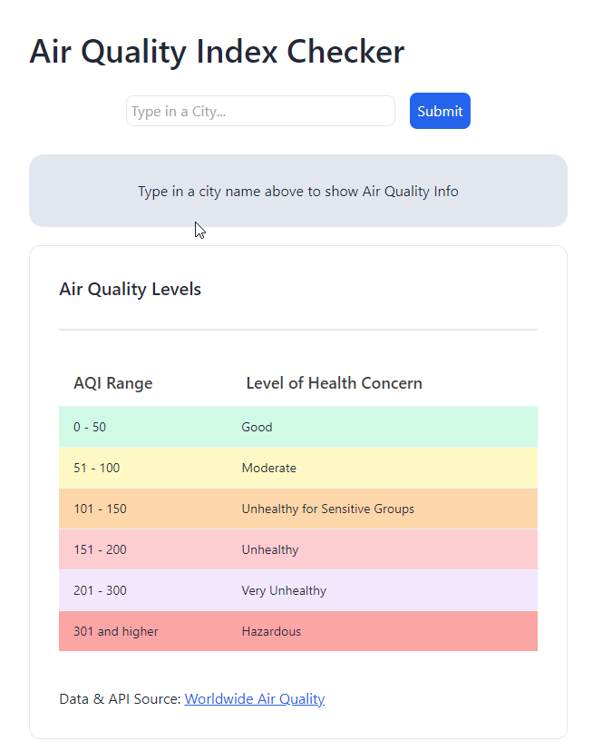

# Air Quality App

The Air Quality App enables users to retrieve real-time information about the air quality in their local city by simply entering their location in the search bar. It promptly provides users with accurate data on their local air quality, along with detailed descriptions explaining the meaning of each measurement.

**Link to project:** https://c4d-react-aqi.netlify.app/

<p align="center">
  
</p>

---
## Installation & Setup

To run the setup locally:

1. Clone/Fork the repo:  
   ```sh 
   git clone ...
   ```
2. Change to app directory: 
   ```sh
   cd {project-directory}
   ```
4. Install NPM Modules: 
   ```sh
   npm install
   ```
5. Register your AQI API key at   
    https://aqicn.org/api/
6. Then copy your API key into `.env.example` file in root  
   after `VITE_API_KEY=` parameter.  

7. Rename the file `.env.example` to `.env`.  
   
8. Run Vite:  
   ```sh
   npm run dev
   ```

--- 

## Goals of this project:

With [recent wildfire events](https://en.wikipedia.org/wiki/2023_Canadian_wildfires) and how it's affecting air qualities in places around the world, the goal of this project is to create an WebApp that allows users to quickly find relavant Air Quality Information based on their city!

**Technologies Used:** React, Vite, TailwindCSS, DaisyUI  

**Data & API Source:** [Worldwide Air Quality](https://aqicn.org/)  

Inspired by Mayanwolfe's project [here](https://github.com/Mayanwolfe/AirQualityApp)

### Techincal Goals:  

This project is used to test out Modern Web Framework Technologies such as:  
- React
  - Components & JSX
- TailwindCSS
  - Utility First Fundamentals
    - Box Model: Border, Padding, Margin, etc.
    - Color
      - Attributes like `Background`,`Font`,`Text-Color` following WCAG contrast
      - Using `React` props & variables to control coloring
    - Responsive design (devices from 360px and up)
  - DaisyUI
    - Themes (Light & Dark Mode)
    - Components: Cards, Tables, etc.

---

## Future Implementations:

- Adding Map View based on Geo Location
  - (similar to Map Tile Widget [here](https://aqicn.org/faq/2015-09-18/map-web-service-real-time-air-quality-tile-api/))
- Modal Alert messages on certain cities

---  
  
## Other Projects:
Checkout my other projects here!

**Kanban Board WebApp:**  
https://github.com/Code4Dopamine/FS-Kanban

**[MS Thesis] Tactile Body-Globe (Tactile Visualization):**
https://github.com/Code4Dopamine/Tactile-Visualization

**Pix2Pix - ML:**  
https://github.com/Code4Dopamine/Pix2Pix-PracticalML


